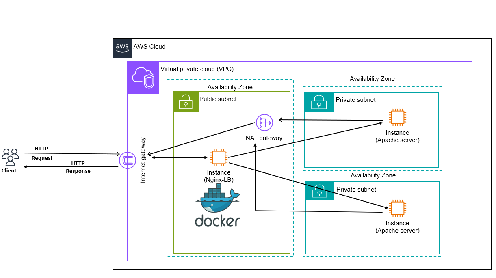
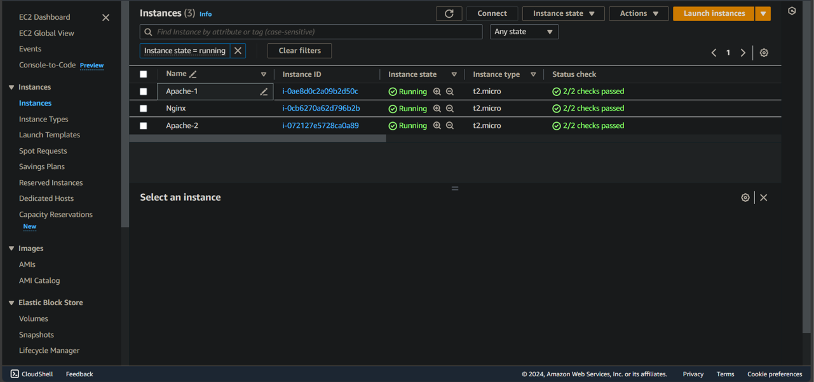
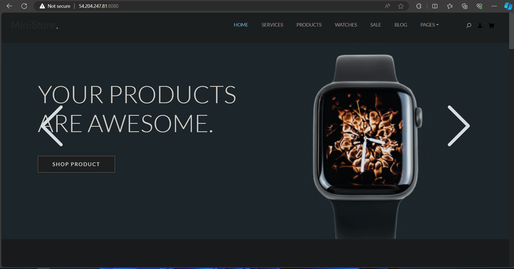
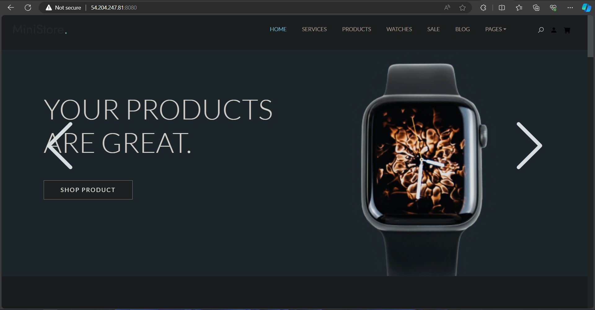

# CloudInfraProvisioner: Terraform VPC, Subnets, EC2, and Load Balancer.

## _What are we going to do in this project?_

In this project we are going to use **_terraform_** to create and manage infrastructure that will be used for hosting an e-commerce static site.

Our infrastructure will basically consist of a VPC that has three subnets, one of them will be public and the other two subnets will be private subnets.

In each subnet there will be an EC2 instance, the one in the public subnet will be running an Nginx (docker container) which will be configured to work as a load balancer and the two instances in the private subnets will be running Apache web server which will be hosting our website.

Along the way we will be creating a lot of other resources that will be needed by our main resources such as a NAT gateway, security groups, etc..

## _Architecture Diagram:_



## _List of the resources that we will create using terraform:_

- VPC.
- Three Subnets.
- Internet Gateway.
- NAT Gateway.
- Public Route table
- Private Route table
- Elastic IP.
- Security Groups.
- Three EC2 instances.
- Key Pair.

## **_How to run the project?_**

- Clone the project:

```bash
git clone https://github.com/Kareem-Ataam/terraform-aws-vpc-ec2-lb.git
```

- Get into the project directory

```bash
cd terraform-aws-vpc-ec2-lb
```

- Initialize terraform in the current project directory:

```bash
terraform init
```

- Create the file you will pass the values for variables in, name it **_`terraform.tfvars`_** you can name it with any other name but you will need to pass it with command that will apply the terraform configuration. The following is a list of the variables that you will need to put values for in the **_`terraform.tfvars`_** file:

```bash
#Region for infrastructure creation
region               =
#CIDR block for the VPC
vpc_cidr_block       =
#According to the environment that the infra will be created for provide a prefix for it(like dev for development)
env-prefix           =
enable_dns_support   =
enable_dns_hostnames =
#List of the subnet CIDR blocks
subnet_cidr_blocks   =
#List of the AZs
avail_zones          =
#List of subnets names (this will be used as tags)
subnet_names         =
#Do you want to assign a public IP address for the machine created in this subnet or--List of booleans
map_pub_ip           =
#Your public IP address and subnet mask /32 like "156.22.22.177/32"
my_ip                =
#List of AMIs
ami_list             =
#List of instance types
instance_types       =
public_key_path      =
#List of strings that specify the paths for scrips that will be passed as user data to instance during boot up
user_data_file_paths =
#List of instance name that will be used as tags
instance_names       =
```

- See the execution plan:

```bash
terraform plan
```

- Apply the terraform configuration files to create and provision the infrastructure:

```bash
terraform apply
```

## **_The project step by step:_**

This terraform project is modularized, there are basically two modules, one of the modules will be responsible for the creation and the VPC and its related resources and the other will be for creating the EC2 instances and their related resources.

### _Creation of the VPC and its related resources:_

The first module as I said will be for the creation of:

- VPC.
- Subnet.
- Internet Gateway.
- Elastic IP.
- NAT Gateway.
- Route tables.

The following code section shows the content of the `***main.tf***` file of the VPC module.

```hcl
# Creation of the VPC.
resource "aws_vpc" "web-vpc" {
  cidr_block           = var.vpc_cidr_block
  enable_dns_support   = true
  enable_dns_hostnames = true
  tags = {
    Name = "${var.env-prefix}-VPC"
  }
}
# Creation of the subnet.
resource "aws_subnet" "vpc-subnet" {
  count                   = length(var.subnet_cidr_blocks)
  vpc_id                  = aws_vpc.web-vpc.id
  cidr_block              = var.subnet_cidr_blocks[count.index]
  availability_zone       = var.avail_zones[count.index]
  map_public_ip_on_launch = var.map_pub_ip[count.index]
  tags = {
    Name = var.subnet_names[count.index]
  }
}
# Creation of the internet gateway.
resource "aws_internet_gateway" "web-igw" {
  vpc_id = aws_vpc.web-vpc.id
  tags = {
    Name = "${var.env-prefix}-IGW"
  }
}
resource "aws_eip" "eip" {
  domain = "vpc"
}
# Creation of the NAT gateway.
resource "aws_nat_gateway" "web-ngw" {
  allocation_id = aws_eip.eip.allocation_id
  subnet_id     = aws_subnet.vpc-subnet[0].id
  tags = {
    Name = "${var.env-prefix}-ngw"
  }
}
# Creation of the public route table.
resource "aws_route_table" "public-rt" {
  vpc_id = aws_vpc.web-vpc.id
  route {
    cidr_block = "0.0.0.0/0"
    gateway_id = aws_internet_gateway.web-igw.id
  }
  tags = {
    Name = "Public-RT-${var.env-prefix}"
  }
}
# Creation of the private route table.
resource "aws_route_table" "private-rt" {
  vpc_id = aws_vpc.web-vpc.id
  route {
    cidr_block     = "0.0.0.0/0"
    nat_gateway_id = aws_nat_gateway.web-ngw.id
  }
  tags = {
    Name = "Private-RT-${var.env-prefix}"
  }
}
```

And the list of the variables that should be declared in the **_`variables.tf`_** file is shown below:

```hcl
variable "vpc_cidr_block" {
  type        = string
  description = "CIDR block of the VPC"
}
variable "subnet_cidr_blocks" {
  type        = list(string)
  description = "List of the subnet CIDR blocks"
}
variable "avail_zones" {
  type        = list(string)
  description = "List of the subnet AZs"
}
variable "subnet_names" {
  type        = list(string)
  description = "List of the subnet names"
}
variable "map_pub_ip" {
  type        = list(bool)
  description = "List of boolen values specifying wheather a public IP address should be assigned automatically to each instance in the subent or not"
}
variable "env-prefix" {}
variable "enable_dns_support" {
  type = bool
}
variable "enable_dns_hostnames" {
  type = bool
}
```

Also there are some attributes that I am outputting as they will be needed in the the module that will create the ec2 instances and the root module, its content can be shown below:

```hcl
output "vpc_id" {
  value = aws_vpc.web-vpc.id
}
output "subnet_info" {
  value = aws_subnet.vpc-subnet[*].id
}
output "public_subnet_id" {
  value = aws_subnet.vpc-subnet[0].id
}
output "public_RT_id" {
  value = aws_route_table.public-rt.id
}
output "private_RT_id" {
  value = aws_route_table.private-rt.id
}
```

### _Creation of the instances and their related resources:_

The second module will be responsible for the creation of the resources below:

- Security groups.
- Key pair.
- EC2-instances.

The following code section shows the content of the **_`main.tf`_** file of the ec2-instance module.

```hcl
# Security group for the instance in the public subnet
resource "aws_security_group" "public-sg" {
  name        = "Nginx-sg"
  description = "Allow SSH and HTTP traffic"
  vpc_id      = var.vpc_id
  tags = {
    Name = "Nginx-sg"
  }
  ingress {
    from_port   = 22
    to_port     = 22
    protocol    = "tcp"
    cidr_blocks = [var.my_ip]
  }
  ingress {
    from_port   = 8080
    to_port     = 8080
    protocol    = "tcp"
    cidr_blocks = ["0.0.0.0/0"]
  }
  egress {
    from_port        = 0
    to_port          = 0
    protocol         = "-1"
    cidr_blocks      = ["0.0.0.0/0"]
    ipv6_cidr_blocks = ["::/0"]
  }
}
# Security group for the instance in the private subnet
resource "aws_security_group" "private-sg" {
  name        = "Apache-sg"
  description = "Allow traffic from the laod balancer (nginx)"
  vpc_id      = var.vpc_id
  tags = {
    Name = "Apache-sg"
  }
  ingress {
    from_port       = 80
    to_port         = 80
    protocol        = "tcp"
    security_groups = [aws_security_group.public-sg.id]
  }
  ingress {
    from_port       = 22
    to_port         = 22
    protocol        = "tcp"
    security_groups = [aws_security_group.public-sg.id]
  }
  egress {
    from_port        = 0
    to_port          = 0
    protocol         = "-1"
    cidr_blocks      = ["0.0.0.0/0"]
    ipv6_cidr_blocks = ["::/0"]
  }
}
#SSH Login Key pair
resource "aws_key_pair" "ssh-key" {
  key_name   = "ssh-key"
  public_key = file(var.public_key_path)
}
#Creation of the EC2 instances
resource "aws_instance" "server" {
  count                  = length(var.ami_list)
  ami                    = var.ami_list[count.index]
  instance_type          = var.instance_types[count.index]
  key_name               = aws_key_pair.ssh-key.key_name
  subnet_id              = var.subnet_info[count.index]
  vpc_security_group_ids = count.index == 0 ? [aws_security_group.public-sg.id] : [aws_security_group.private-sg.id]
  user_data              = file(var.user_data_file_paths[count.index])
  tags = {
    Name = var.instance_names[count.index]
  }
}
```

And the list of the variables that should be declared in the **_`variables.tf`_** file is shown below:

```hcl
variable "my_ip" {
  type        = string
  description = "Your public IP address"
}
variable "ami_list" {
  type = list(string)
}
variable "instance_types" {
  type = list(string)
}
variable "public_key_path" {
  type = string
}
variable "user_data_file_paths" {
  type = list(string)
}
variable "vpc_id" {
  type = string
}
variable "subnet_info" {
  type = list(string)
}
variable "instance_names" {
  type = list(string)
}
```

### _The root module:_

The root module basically contains the file **_`providers.tf`_** ,which defines the provider we are using which is in this case AWS and the version of its plugin to be installed, Also it contains the **_`main.tf`_** which invokes the modules that we created and perform the required associations between the route tables and the instances, finally the file **_`variables.tf`_** which contains the declaration for the needed variables.

For the **_`providers.tf`_** file:

```bash
terraform {
  required_providers {
    aws = {
      source  = "hashicorp/aws"
      version = "5.37.0"
    }
  }
}

provider "aws" {
  region = var.region
}
```

For the **_`main.tf`_** file:

```hcl
module "web-vpc" {
  source               = "./modules/vpc"
  vpc_cidr_block       = var.vpc_cidr_block
  env-prefix           = var.env-prefix
  enable_dns_support   = var.enable_dns_support
  enable_dns_hostnames = var.enable_dns_hostnames
  subnet_cidr_blocks   = var.subnet_cidr_blocks
  avail_zones          = var.avail_zones
  subnet_names         = var.subnet_names
  map_pub_ip           = var.map_pub_ip
}
###########################################################
locals {
  vpc_id = module.web-vpc.vpc_id
}
###########################################################
resource "aws_route_table_association" "rt-assoc-public" {
  subnet_id      = module.web-vpc.subnet_info[0]
  route_table_id = module.web-vpc.public_RT_id
}
resource "aws_route_table_association" "rt-assoc-private-1" {
  subnet_id      = module.web-vpc.subnet_info[1]
  route_table_id = module.web-vpc.private_RT_id
}
resource "aws_route_table_association" "rt-assoc-private-2" {
  subnet_id      = module.web-vpc.subnet_info[2]
  route_table_id = module.web-vpc.private_RT_id
}
#############################################################
module "instances" {
  source               = "./modules/ec2-instance"
  my_ip                = var.my_ip
  ami_list             = var.ami_list
  instance_types       = var.instance_types
  public_key_path      = var.public_key_path
  user_data_file_paths = var.user_data_file_paths
  vpc_id               = module.web-vpc.vpc_id
  subnet_info          = module.web-vpc.subnet_info
  instance_names       = var.instance_names
}
```

For the **_`variables.tf`_** file:

```hcl
variable "region" {
  type        = string
  description = "Region at which  to create the resources."
}
variable "vpc_cidr_block" {
  type        = string
  description = "CIDR block of the VPC"
}
variable "subnet_cidr_blocks" {
  type        = list(string)
  description = "List of the subnet CIDR blocks"
}
variable "avail_zones" {
  type        = list(string)
  description = "List of the subnet AZs"
}
variable "subnet_names" {
  type        = list(string)
  description = "List of the subnet names"
}
variable "map_pub_ip" {
  type        = list(bool)
  description = "List of boolean values specifying weather a public IP address should be assigned automatically to each instance in the subnet or not"
}
variable "env-prefix" {}
variable "enable_dns_support" {
  type = bool
}
variable "enable_dns_hostnames" {
  type = bool
}
###################################
variable "my_ip" {
  type        = string
  description = "Your public IP address"
}
variable "ami_list" {
  type = list(string)
}
variable "instance_types" {
  type = list(string)
}
variable "public_key_path" {
  type = string
}
variable "user_data_file_paths" {
  type = list(string)
}
variable "instance_names" {
  type = list(string)
}
```

Finally, if you want to run the project you will need to write the **_`terraform.tfvars`_** file which contains the values needed for the used variables or you can pass them any way you like.

I just want to give a note on a variable that you will need to pass for and it’s **_`user_data_file_paths`_** which is a list containing the paths of the scripts that will be run on the instances in order, in my case I am running three instances the first is in a public subnet and i want it to run Nginx docker container so I provided the path of the following script (nginx.sh):

```bash
#!/bin/bash
sudo yum update -y && sudo yum install -y docker
sudo systemctl start docker
sudo usermod -aG docker ec2-user
docker run --name nginx-lb -p 8080:80 nginx
```

The other two subnets run in private subnets and they are the instances which run Apache web server that hosts the site.

I passed this script path **_`web_server.sh`_**:

```bash
#!/bin/bash
WEBSITE_URL="https://codeload.github.com/themewagon/MiniStore/zip/refs/tags/v1.0.0"
sudo yum update -y && sudo yum install -y unzip httpd
sudo systemctl start httpd
wget $WEBSITE_URL
unzip v1.0.0
RESULTING_DIRECTORY=$(ls -td -- */ | head -n 1 | cut -d'/' -f1)
sudo mv $RESULTING_DIRECTORY/* /var/www/html/
sudo systemctl restart httpd
```

All the scripts is in the repo in the directory **_`scripts`_** .

After running the project as I shown in a section above you will have all the resources created and available for use—**_The image below just show the instances_**:



Now we need to login to the instance called Nginx to configure Nginx to work as load balancer and balance the load over the two instances in the private subnets:

- SSH into the instance.
- Run the command:

```bash
docker exec -it nginx-lb bash
```

- Open the file **_`nginx.conf`_** and paste the following script into it (Adjust the **_`ip:port`_** as it’s for the instances in the private subnets).

```bash
http{
    upstream web_servers {
        server   ip:port;
        server   ip:port;
    }
    server {
        listen 80;
        location / {
            proxy_pass  http://web_servers;
        }
    }
}
```

- Reload Nginx:

```bash
nginx -s reload
```

Now you should be able to access the site just paste in the browser the public IP address of the load balancer and the port number (8080) and you should be able to see the site as below:



I have done a little change in the **_`index.html`_** file in one of the web servers, one of them has “YOUR PRODUCTS ARE AWESOME” and the other says “YOUR PRODUCTS ARE GREAT” just to ensure that Nginx is acting as intended.


